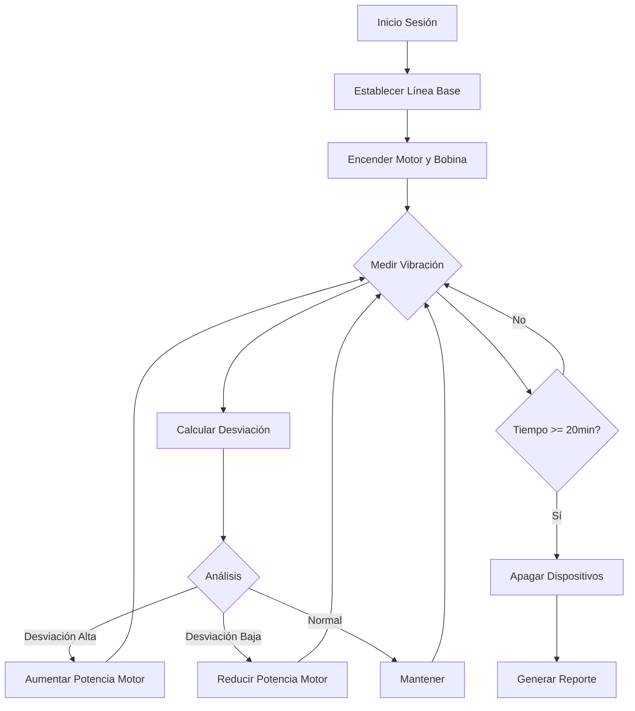

# PROTOCOLO: Medición y Feedback en Tiempo Real

## Objetivo del Sistema
Implementar un bucle cerrado de control que:
1. **MIDE** la vibración mecánica del tejido usando un acelerómetro (MPU6050).
2. **ANALIZA** si la vibración se desvía de la "línea base saludable".
3. **ACTÚA** ajustando la potencia de salida del motor (12 Hz) y bobina (432 Hz) para llevar el tejido hacia un estado de coherencia.

## Flujo de Datos por Sesión


## Parámetros del Algoritmo de Feedback
| Condición (Desviación de la línea base) | Acción Correctiva | Objetivo Biológico |
| :--- | :--- | :--- |
| **> +0.5 unidades** | Aumentar potencia del motor al 80% | **Imponer ritmo** en tejido caótico |
| **Entre -0.1 y +0.5** | Mantener potencia del motor al 50% | **Sostener** frecuencia de sincronización |
| **< -0.1 unidades** | Reducir potencia del motor al 30% | **Estimulación suave** de tejido rígido |

*Nota: Las "unidades" son la magnitud de aceleración (g) del MPU6050. Los umbrales exactos se calibrarán en el estudio preclínico.*

## Salida de Datos
El sistema genera un log por sesión con formato CSV para análisis posterior:
```
timestamp_ms, vibracion_actual, desviacion, potencia_motor_pwm, temperatura
123456789, 1.245, 0.345, 204, 36.7
...
```
